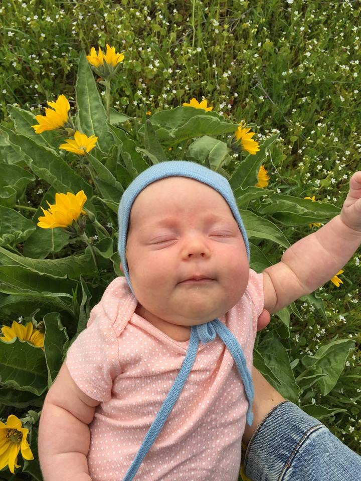

# Reflection & Goals

Today I will work on reflecting my strengths and weaknesses as a programmer, and set goals and tactics to help me achieve my coding aspirations, practice some code challenges, read and gather helpful resources, and document it along the way. Cheers!

Todays resources and adventures:

* I started with a simple whiteboard todo list (and a la croix to start the day off right):

* I read this article for inspiration: [Routine Success](http://gedd.ski/post/routines/)
> This is Your Year 💪
* [Code Newbie 2018 challenges](http://2018.codenewbie.org/ - ). I signed up for: **_Get A Job |  9 weeks, 9 missions_** This challenge starts January 26th, 2018 - great timing!
* I read [this](http://wuhaus.com/2018/01/01/intentions-goals-for-2018/) article on intentions and goals for 2018 by an inspring Portland girl I follow on the social medias.
* I read [this](https://hackernoon.com/the-top-javascript-trends-to-watch-in-2018-a8437dd94425) article on Medium.com about Vue.js and now I really want to learn that language.
* [Another Medium article](https://betterhumans.coach.me/wabi-sabi-on-the-perfection-of-imperfection-and-the-understated-benefits-of-acceptance-f7d468d4a9fd) that I liked - was not programming related, but did make me think about life and acceptance.
 > "wabi-sabi" is about a simple, humble, and gracious existence — fully understanding and embracing both yourself and the undeniable truth of impermanence.

* I looked at a few of the projects (like [this](https://remixtoplankton.glitch.me/) one) on [Glitch](https://glitch.com/) - an awesome site that inspires me to code.
* p5.js - I watched [this](http://hello.p5js.org/) intro video (again) and really want to build something in p5
* I signed up for a [Hacker Rank](https://www.hackerrank.com/dashboard) account as per the Epicodus prompt suggested and toured the site and started a 10 day javaScript challenge. Thank you for the tip!
* I signed up for a ladies happy hour for design and tech minded gals.
* I watched the youTube [link](https://www.youtube.com/watch?v=8aGhZQkoFbQ) "What is an event loop" and it was great.
* I read [this](https://stories.jotform.com/7-reasons-why-you-should-use-react-ad420c634247) article on React
* I ordered these on Amazon:
 * [The Self-Taught Programmer: The Definitive Guide to Programming Professionally](https://www.amazon.com/Self-Taught-Programmer-Definitive-Programming-Professionally-ebook/dp/B01M01YDQA/ref=sr_1_3?s=digital-text&ie=UTF8&qid=1516988232&sr=1-3&keywords=programming)
 * [Learning JavaScript: JavaScript Essentials for Modern Application Development](https://www.amazon.com/Learning-JavaScript-Essentials-Application-Development/dp/1491914912/ref=sr_1_15?ie=UTF8&qid=1516988470&sr=8-15&keywords=javascript)
* I went to Powell's and bought this: [Cracking the Coding Interview: 189 Programming Questions and Solutions](https://www.amazon.com/Cracking-Coding-Interview-Programming-Questions/dp/0984782850/ref=sr_1_1?s=books&ie=UTF8&qid=1516988534&sr=1-1&keywords=cracking+the+coding+interview)

Today's list of things to work on:
* List out and reflect core values - see below on things I value: 

* Update linkedIn
* Clean up Github: Add readmes, etc.
* Whiteboard a code challenge
* Create/collect vocab and terms list and resources
* Readme list out strengths/weaknesses
* Email recruiter about internship
* Email about Norway Internship
* Email about shadowing dev team in Portland
* list of companies to look at for jobs/internships
* update HostGator to host more sites
* Start planning Maxkr's site - WP React
* Start planning Hana's site - WP React
* Work on cover letter template
* work on core value list - use for strengths/weaknesses
* Free Code Camp challenge

## This Is My Year
It's a good time of year to set goals and reflect on what we did last year, what goals worked, goals that failed, and from there use lessons learned to find patterns, good and bad, to help direct this year into setting and achieving new goals.

##### Goal #1 - Get a Job as a Programmer

This year, my one big career goal - my guiding star - is **I want to get a job as a programmer**. That goal is a big one, seeing as I am still in coding school and feel like I have so much more to learn. But I'm confident it's achievable by setting *lead measures*, actions done consistently that lead to an outcome I want, and building those lead measures into a routine.

**The first lead measure is code everyday for an hour**. This is an easy task in code school, where we stand at a computer and code for 8 hours a day, and have homework and lots of projects to work on over the weekend to achieve this goal. I want to continue this lead measure of coding everyday for an hour through this year.

There are awesome resources out there like JavaScript30 with Wes Bos, with 30 coding challenges in vanilla javascript that will help really set the foundations of JavaScript. Another great resource is hackerrank, which I just discovered today in the assignment. It is a site that has coding challenges, and online lesson plans available and at my fingertips. I also want to do FreeCodeCamp challenges, as well as other tutorials for things that really interest me, like p5.js(!!) and interactive web development.

I  think that coding for an hour a day is something that will be easy to do, but making the time once I am out of school and getting in the routine is something I will really have to have self discipline about.

##### Goal #2 - Build something meaningful once a quarter
The second lag measure - or big goal of the year - **is to build something meaningful at least once a quarter**. This is definitely related to the first goal, and will help me get there, but it is separate. It's using the skills I've learned in code school an on my own to really dive into code, and produce something meaningful. I have a few different ideas of things I want to code and this year and I think that breaking up the year into quarters is a good way to set myself up for success.

The first quarter will be easy with our school capstone project that will line up nicely with a Q1 goal. This project is a React project of our choosing. I am excited to flex my newly gained React skills to build something meaningful. For the other 3 quarters, I have plans for a few different websites (for my sister's, and bother-in-law, as well as a few web apps and interactive projects on my list). Lead measures to get here are planning out the user stories and wireframes for each site/app. From there it is getting in the habit of using my one hour a day of coding to spend that time wisely with an end goal in mind.

#### Goal #3 - Run a 20 mile trail run and don't die
Not programming or career related, but I love being active and healthy! On April 8th I am signed up to run a 20 mile trail run in Sisters for the second time. Last time around I didn't put in enough training and really felt like it was a hard slow race. This year I have a running schedule, my lead measures, to run twice a week at least 5 miles and a long run on the weekend. This is an adapted marathon training schedule from REI that I'm adjusting to my schedule and needs. I think that I can run faster than I did last time, but also not feel like death at the end. Also, I'm training my dog to run it with me - she's my main motivation these days!

Of course I want to stay in shape through the year, and run a really fast Silver Falls half marathon in November again. This is the run that got me into trail running. I've done it now 5 years in a row and it is so much fun and beautiful (you run behind 3 waterfalls). Keeping healthy and in shape is one of the best ways for me to feel good and manage my stress. I love exercise so much!

And since it's Friday and I love my baby Ina, here's a picture of her on a hike in the gorge surrounded by wild sunflowers ✨
🌻💛 
